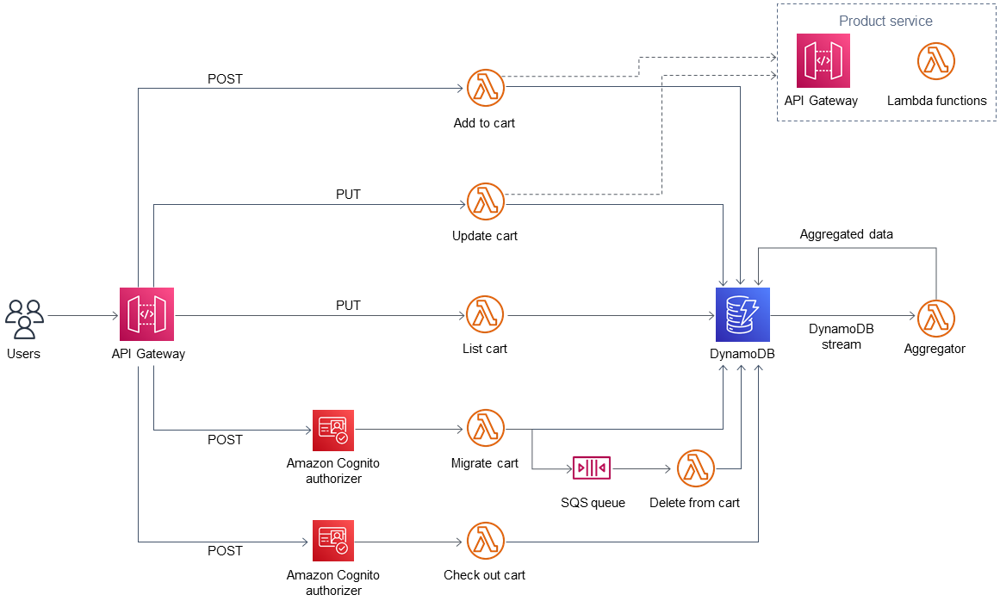
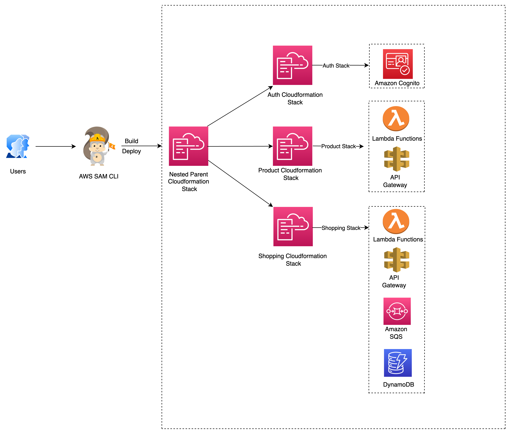

# Amazon Serverless Application Model (SAM)
Amazon Serverless Application Model (SAM) is an open-source framework for building serverless applications. It provides shorthand syntax to express functions, APIs, databases, and event source mappings. With just a few lines per resource, you can define the application you want and model it using YAML. During deployment, SAM transforms and expands the SAM syntax into AWS CloudFormation syntax, enabling you to build serverless applications faster.

AWS SAM simplifies the development, deployment, and management of serverless applications on the AWS platform. It provides a standardised framework, faster deployment, local testing capabilities, resource management, seamless Integration with Development Tools, and a supportive community, making it a valuable tool for building serverless applications efficiently and effectively.

This code uses AWS SAM templates to automate the deployment of nested applications. A nested application is an application within another application. Parent applications call their child applications. These are loosely coupled components of a serverless architecture. 

Using nested applications, you can rapidly build highly sophisticated serverless architectures by reusing services or components that are independently authored and maintained but are composed using AWS SAM and the Serverless Application Repository. Nested applications help you to build applications that are more powerful, avoid duplicated work, and ensure consistency and best practices across your teams and organizations. To demonstrate nested applications, the pattern deploys a sample AWS serverless shopping cart application.

## Target architecture 




In this solution setup, AWS SAM CLI serves as the interface for AWS CloudFormation stacks. AWS SAM templates automatically deploy nested applications. The parent SAM template calls the child templates, and the parent CloudFormation stack deploys the child stacks. Each child stack builds the AWS resources that are defined in the AWS SAM CloudFormation templates



## Prerequisites 

1. An active AWS account

2. An existing virtual private cloud (VPC) and subnets

3. Python wheel library installed using pip install wheel, if it’s not already installed

## Useful commands

 * `sam build`          Builds a serverless application and prepares it for subsequent steps
 * `sam deploy`         Deploys an AWS SAM application.
 * `sam init`           Initializes a serverless application with an AWS SAM template
 * `sam logs`           Fetches logs that are generated by your Lambda function.
 * `sam package`        Packages an AWS SAM application.
 * `sam publish`        Publish an AWS SAM application to the AWS Serverless Application Repository
 * `sam validate`       Verifies whether an AWS SAM template file is valid.

## Deployment Steps

Check out this APG Pattern for detailed deployment instructions: [Automate deployment of nested applications using AWS SAM](https://docs.aws.amazon.com/prescriptive-guidance/latest/patterns/automate-deployment-of-nested-applications-using-aws-sam.html?did=pg_card&trk=pg_card)

### 1. Deploy the applications.

To launch the SAM template code that creates the nested application CloudFormation stacks and deploys code in the AWS environment, run the following command:

```
$sam deploy --guided --stack-name shopping-cart-nested-stack --capabilities CAPABILITY_IAM CAPABILITY_AUTO_EXPAND

```

### 2. Verify the deployment

To review and verify the AWS CloudFormation stacks and all AWS resources that were defined in the AWS SAM templates, log in to the AWS Management Console. For more information, see the Additional information section.


### 3. Clean up
To clean up the resources, run the command:

```
$sam delete

```


## Security

See [CONTRIBUTING](CONTRIBUTING.md#security-issue-notifications) for more information.


## License

This project is licensed under the Apache-2.0 License.

